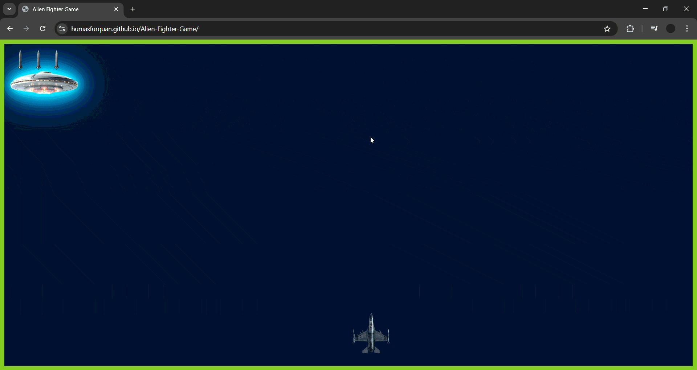

# 🚀 Alien Fighter Game
```md


```

A fast-paced **2D space shooter game** built using **HTML, CSS, and Vanilla JavaScript**.  
Survive as long as possible while dodging alien attacks and shooting down UFOs in a dynamic animated space environment.

🎮 **Play. Survive. Beat Your High Score.**

---

## 🎥 Gameplay Demo



---

## 📸 Screenshots

| Game Arena | Plane Shooting | Game Over |
|-----------|----------------|-----------|
|  |  |  |

---

## 🎮 Gameplay Features

- 🛸 **Smart Alien UFO**
  - Moves dynamically across the screen
  - Attacks only when aligned with the player
  - Changes appearance after taking damage

- 🚀 **Player Fighter Plane**
  - Smooth keyboard controls
  - Center-aligned shooting
  - Frozen instantly on game over

- 💥 **Missile System**
  - Limited missiles displayed on screen
  - Real-time missile usage feedback
  - Accurate collision detection

- 🌌 **Animated Space Background**
  - Multi-layer canvas animation
  - Star-field speed effect
  - Planet transition visuals

- 🏆 **Scoring System**
  - Score based on survival time
  - Highest score stored using `localStorage`
  - Displayed on game over screen

- ☠️ **Game Over Effects**
  - Full blackout screen
  - Sound effect on player hit
  - Clean game over UI
  - Play Again option

---

## 🕹️ Controls

### Desktop Controls
| Action | Key |
|------|----|
| Move Left | ⬅️ Arrow Left |
| Move Right | ➡️ Arrow Right |
| Move Up | ⬆️ Arrow Up |
| Move Down | ⬇️ Arrow Down |
| Shoot | Spacebar |

---

## 🛠️ Tech Stack

- **HTML5** (Canvas, Game Structure)
- **CSS3** (Animations, Effects, UI)
- **JavaScript (ES6 Modules)**
- **Canvas API**
- **LocalStorage** (High Score)

---

## 📁 Project Structure

```
Alien-Fighter-Game/
│
├── asset/
│   ├── Fighter Plane.png
│   ├── Alien Ship.png
│   ├── Missile.png
│   ├── ufo1.png ... ufo9.png
│   └── sound files
│
├── js/
│   ├── game.js
│   ├── player.js
│   ├── alien.js
│   ├── missiles.js
│   └── canvas.js
│
├── index.html
├── style.css
└── README.md
```

---

## 🚀 How to Run Locally

```bash
# Clone repository
git clone https://github.com/your-username/Alien-Fighter-Game.git
cd Alien-Fighter-Game

# Open the folder
cd Alien-Fighter-Game

```

# Run using Live Server (recommended)
VS Code → Right click index.html → Open with Live Server

---

## 🌍 Play Online

The game is deployed using GitHub Pages
👉 [https://humasfurquan.github.io/Alien-Fighter-Game/](https://humasfurquan.github.io/Alien-Fighter-Game/)

---

## 🧠 Future Improvements

* Mobile touch controls 📱
* Boss fight mode 👑
* Power-ups and shields ⚡
* Sound toggle 🔊
* Pause / Resume feature ⏸️

---

## 📚 What I Learned

- Canvas-based game rendering
- Game loop and state management
- Collision detection logic
- Modular JavaScript architecture
- GitHub Pages deployment

---

## 👨‍💻 Author

**Humas Furquan**
GitHub: [https://github.com/HumasFurquan](https://github.com/HumasFurquan)

---

## ⭐ Support

If you like this project:

* ⭐ Star the repository
* 🍴 Fork it
* 🧠 Suggest improvements

---
